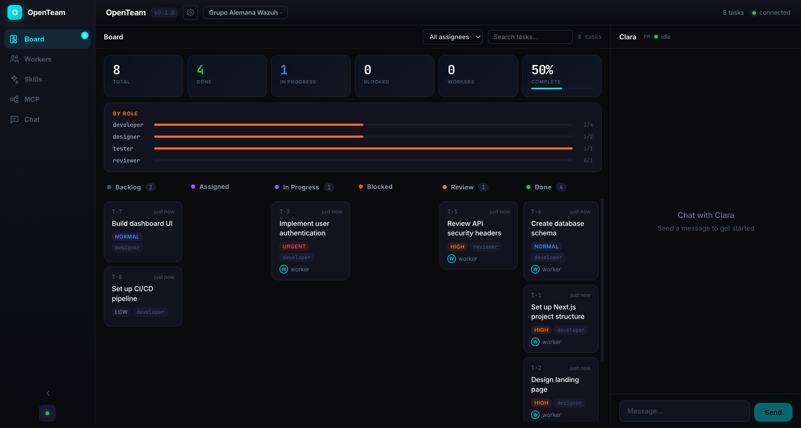
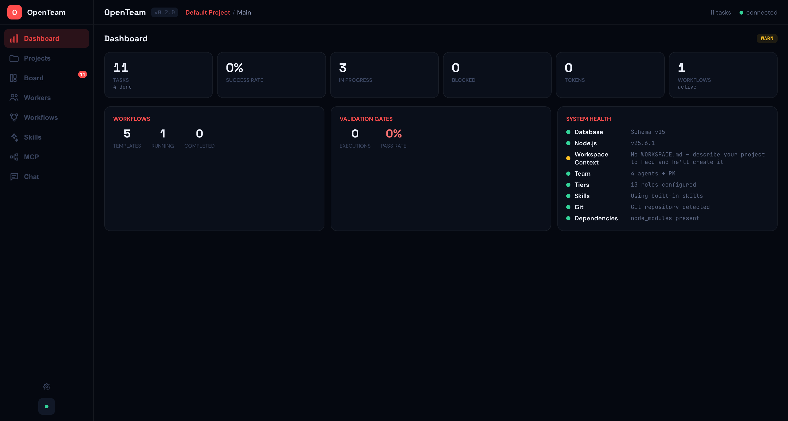
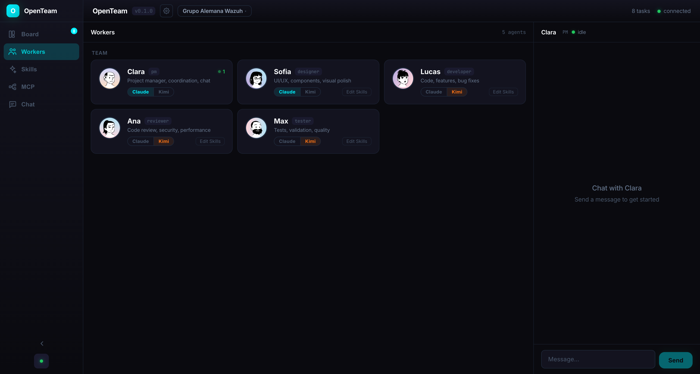
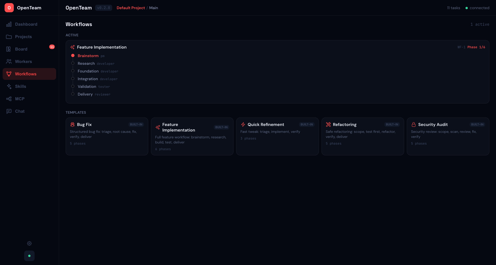
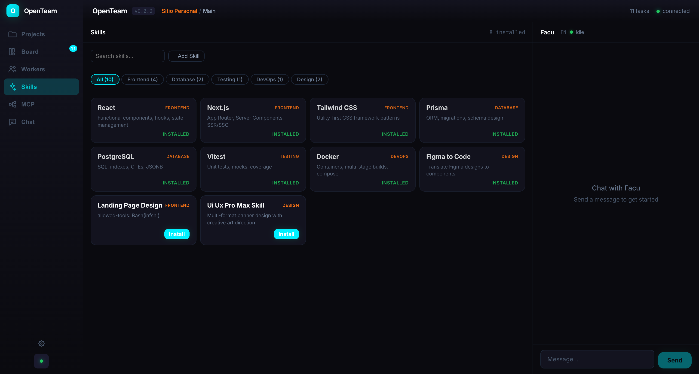
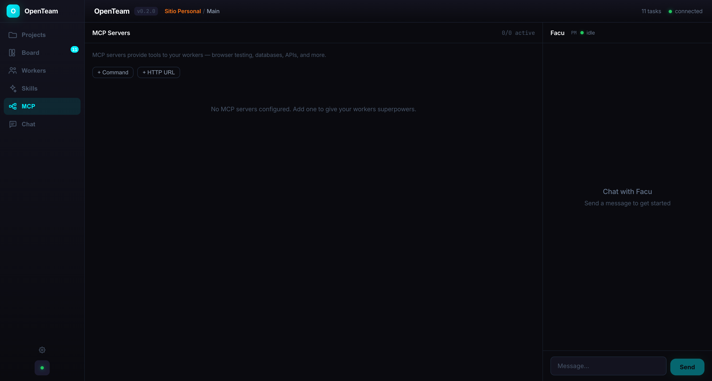
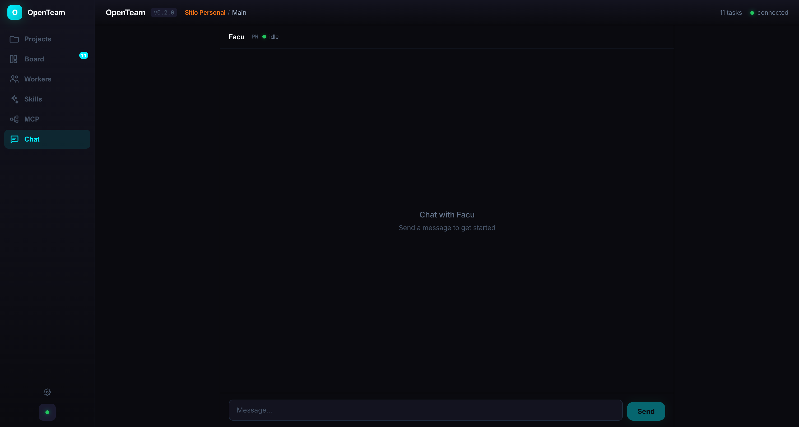

<p align="center">
  
</p>

<h1 align="center">OpenTeam</h1>

<p align="center">
  <a href="https://github.com/safernandez666/openteam/actions"></a>
  <a href="https://nodejs.org/"></a>
  <a href="LICENSE"></a>
  <a href="CHANGELOG.md"></a>
</p>

<p align="center">
  <strong>Your AI development team, ready to ship.</strong><br/>
  Spawn autonomous agents that write code, design UI, run tests, and review PRs — all orchestrated from a single dashboard.
</p>

<p align="center">
  <a href="#quick-start">Quick Start</a> &bull;
  <a href="#features">Features</a> &bull;
  <a href="#architecture">Architecture</a> &bull;
  <a href="#the-team">The Team</a> &bull;
  <a href="#workflows">Workflows</a> &bull;
  <a href="#configuration">Configuration</a> &bull;
  <a href="#cli">CLI</a> &bull;
  <a href="docs/architecture.md">Docs</a>
</p>

---

## What is OpenTeam?

OpenTeam is an **AI agent orchestration framework** that gives you a virtual development team. Each agent is a real CLI session (Claude Code or Kimi Code) with role-specific expertise, modular skills, and MCP tool access.

You talk to **Facu** (the PM). He creates tasks, assigns them to the right agent, and they execute autonomously — with real-time output streaming to your browser.

No prompting. No copy-pasting. Just describe what you need and watch your team build it.

> **New to OpenTeam?** Check out the [Architecture Overview](docs/architecture.md) to understand how it works under the hood, or the [Data Model](docs/data-model.md) for the database schema.

## Quick Start

```bash
# Install globally
npm install -g openteam-cli

# Or run directly
npx openteam-cli start
```

```bash
# From source
git clone https://github.com/safernandez666/openteam.git
cd openteam && pnpm install && pnpm build && pnpm start
```

Open **http://localhost:4200** and start chatting with Facu.

### Requirements

- Node.js >= 22
- pnpm >= 9 (for development)
- [Claude Code](https://docs.anthropic.com/en/docs/claude-code) or [Kimi Code](https://kimi.ai) CLI installed

## Features

### Dashboard

Unified view of your team's performance: success rate, total tasks, active workflows, token usage, agent performance table, validation gate health, and system doctor checks — all in one screen.

<p align="center">
  
</p>

### Project & Workspace Hierarchy

Organize your work as **Projects** (one per client or product) containing multiple **Workspaces** (one per area: API, Frontend, SIEM). Each workspace is fully isolated — its own database, team, MCP servers, and chat history. Switch between workspaces at runtime without restarting the server.

### Kanban Board

Full-width kanban with drag & drop, search, filters, and stats bar. Tasks update in real-time as workers complete them. Token tracking per task.

<p align="center">
  
</p>

### AI Agent Team

Build your team from a catalog of 13 specialized roles. Each agent gets a unique avatar (DiceBear), an editable name, an independent AI provider toggle, and a **model tier** (Economy/Fast/Standard/Quality/Premium) that controls cost vs quality routing.

<p align="center">
  
</p>

### Workflow Templates

5 built-in multi-phase workflows: Bug Fix, Feature Implementation, Quick Refinement, Refactoring, and Security Audit. Each defines phases with roles, exit criteria, and auto-detection from user input. Workflows auto-advance — when a phase task completes, the next phase starts automatically.

<p align="center">
  
</p>

### Skills & Marketplace

Install skill packs from GitHub or create them inline. AI auto-categorizes each install. Skills are global (shared across all workspaces). **Skill Matrix** maps capability slots (framework, database, styling, testing) to concrete tech — changing stack means updating one JSON, not agent files.

<p align="center">
  
</p>

### MCP Integration

Connect your agents to external tools via Model Context Protocol (MCP). Quick Add: paste a GitHub URL or npm package name and it auto-configures. Each workspace has its own MCP configuration.

<p align="center">
  
</p>

### Chat with Facu

Natural conversation with your PM in any language. He creates tasks, manages workflows, checks status, and coordinates the team. Workflow-aware: detects bug fixes, features, refactors from your message and suggests the right workflow.

<p align="center">
  
</p>

### And more...

- **Model Tiers** — Economy/Fast/Standard/Quality/Premium per role, auto-inferred from task complexity
- **Validation Gates** — 9 configurable quality checks (secret scan, lint/test/build, blast radius, dependency audit, fast review, browser test, regression test, panel review, smoke test)
- **Agent Memory** — lessons learned, known issues, agent failure DLQ. Workers read lessons before starting
- **Architecture Decision Records** — ADRs per workspace, injected into worker context
- **Context Compaction** — structured summaries replace raw output for downstream workers
- **Session Checkpoints** — workspace state persisted on shutdown, restored on restart
- **Performance Analytics** — success rate, duration, tokens, per-category breakdown per agent
- **Token tracking** — input/output tokens per task, global counter on board
- **Task dependencies & subtasks** with cycle detection
- **Error handling with automatic retry** (configurable max attempts)
- **Worker output streaming** in real-time
- **Knowledge base** with keyword-triggered document injection
- **Drag & drop** kanban with toast notifications
- **Runtime hot-swap** — switch workspaces without server restart
- **Graceful shutdown** — SIGTERM/SIGINT persist checkpoints and stop workers
- **Desktop app** — Electron wrapper (scaffold ready)

## Advanced Usage

### Create a workspace with a specific tech stack

```bash
openteam start
# In the UI: Create Project → Create Workspace → Set working directory to your repo
# Facu will scan the repo and suggest skills automatically
```

### Install a custom skill from GitHub

```bash
# Via UI: Skills → Install → paste GitHub URL
# Or via CLI:
openteam skills add https://github.com/user/my-skill-repo
```

### Debug a stuck worker

```bash
# Check active processes
ps aux | grep "claude --print"

# Kill stale workers
pkill -f "claude --print"

# Retry the task via CLI
openteam task update T-42 -s backlog
openteam task update T-42 -s assigned
```

### Export workspace data

```bash
# SQLite database location
~/.openteam/projects/<project>/workspaces/<workspace>/openteam.db

# Export tasks to JSON
sqlite3 openteam.db "SELECT json_object('id', id, 'title', title, 'status', status) FROM tasks;"
```

### Run health checks

```bash
# Via UI: Dashboard → Doctor tab
# Or via API:
curl http://localhost:4200/api/doctor
```

## The Team

| Role | Default Name | Tier | What they do |
|------|-------------|------|-------------|
| PM | Facu | Quality | Coordinates the team, manages tasks and workflows |
| Developer | Lucas | Quality | Writes code, implements features, fixes bugs |
| Architect | — | Quality | System design, ADRs, technology evaluation |
| API Designer | — | Standard | Route architecture, endpoint conventions |
| Data Engineer | — | Standard | ETL pipelines, scrapers, data processing |
| Designer | Sofia | Quality | UI/UX, interfaces, components, visual polish |
| Tester | Max | Fast | Tests, validation, quality assurance |
| Reviewer | Ana | Economy | Code review, security, performance |
| DevOps | — | Fast | CI/CD, Docker, deployments |
| Security | — | Quality | Auth, RLS, CSP, vulnerability management |
| Copywriter | — | Economy | UI microcopy, marketing text, docs |
| SEO | — | Economy | Meta tags, structured data, crawlability |
| Performance | — | Standard | Profiling, bundle size, Core Web Vitals |

Tiers determine provider routing: Economy/Fast use Kimi (cheaper), Standard/Quality/Premium use Claude (better reasoning). All names, tiers, and providers are configurable per workspace.

## Workflows

| Template | Phases | Use When |
|----------|--------|----------|
| Bug Fix | Triage → RCA → Fix → Test → Review | "hay un bug", "fix", "broken" |
| Feature | Brainstorm → Research → Foundation → Integration → Test → Review | "add", "implement", "build" |
| Quick Refinement | Triage → Implement → Verify | "tweak", "adjust", "polish" |
| Refactoring | Scope → Test First → Refactor → Verify → Review | "refactor", "rewrite", "clean up" |
| Security Audit | Scope → Scan → Review → Fix → Verify | "security", "audit", "vulnerability" |

Facu auto-detects the workflow type from your message and validates the team has required roles before starting. Custom templates supported.

## Architecture

```
You <-> Facu (PM Chat) <-> MCP Tools <-> TaskStore (SQLite)
                                              |
                                    Orchestrator (polls every 3s)
                                              |
                              TierEngine → Provider Selection
                                              |
                                    WorkerRunner (Claude/Kimi CLI)
                                              |
                                    CompactionEngine → Context
```

**Monorepo structure:**

```
packages/
  core/       SQLite, TaskStore, Orchestrator, SkillLoader, McpManager,
              KnowledgeBase, WorkflowEngine, TierEngine, GateEngine,
              AgentMemory, PerformanceTracker, CompactionEngine,
              CheckpointManager, DecisionStore, HealthChecker
  web/        Express + WebSocket server, all API routes
  ui/         React + Vite (Dashboard, Board, Workers, Workflows,
              Skills, MCP, Chat, Projects)
  cli/        CLI entry point (openteam command)
  desktop/    Electron wrapper (scaffold)
```

## Configuration

**Global** (shared across all projects and workspaces) in `~/.openteam/`:

| File | Purpose |
|------|---------|
| `skills/` | Role prompts (built-in + user-installed) |
| `skills/modules/` | Modular skills from marketplace |
| `skills/skill-matrix.json` | Tech stack slot bindings |
| `skills/role-skills.json` | Skill-to-role assignments |
| `marketplace.json` | User-curated skill catalog |

**Per workspace** in `~/.openteam/projects/<project>/workspaces/<workspace>/`:

| File | Purpose |
|------|---------|
| `openteam.db` | Tasks, chat, workflows, gates, performance, decisions, checkpoints, compactions (SQLite, v15) |
| `WORKSPACE.md` | Project context for all workers |
| `project-config.json` | Working directory, repo, branch, provider |
| `team-config.json` | Team composition (roles + names + providers) |
| `agent-config.json` | Agent names, providers, avatar seeds |
| `knowledge/` | Docs with `read_when` keyword injection |
| `mcp-servers.json` | MCP server configurations |

## CLI

```bash
openteam start                    # Start server on port 4200
openteam tasks                    # List all tasks
openteam tasks --status backlog   # Filter by status
openteam task create "title"      # Create a task
openteam task create "Fix bug" -p high -a worker -r developer
openteam task update T-5 -s done  # Update task status
openteam skills                   # List skills
openteam skills add <url>         # Install from GitHub
openteam skills remove <name>     # Remove a skill
openteam context                  # Show WORKSPACE.md
openteam context set <file>       # Set project context
openteam status                   # System status
```

## API Reference

| Endpoint | Purpose |
|----------|---------|
| `GET /api/health` | Server health |
| `GET /api/doctor` | System health checks (8 checks) |
| `GET /api/dashboard/*` | Dashboard aggregations |
| `GET/POST /api/tasks` | Task CRUD |
| `DELETE /api/tasks/:id` | Delete task |
| `POST /api/tasks/:id/retry` | Retry failed task |
| `GET/POST /api/projects` | Project CRUD |
| `GET/POST /api/team/members` | Team management |
| `GET/PUT /api/tiers/:roleId` | Model tier configuration |
| `GET/POST /api/workflows/templates` | Workflow templates |
| `GET/POST /api/workflows/instances` | Workflow instances |
| `GET/POST /api/decisions` | Architecture Decision Records |
| `GET/POST /api/memory/lessons` | Lessons learned |
| `GET/POST /api/memory/issues` | Known issues |
| `GET /api/memory/failures` | Agent failure DLQ |
| `GET /api/performance` | Agent performance stats |
| `GET /api/gates/definitions` | Validation gate definitions |
| `GET /api/skill-matrix` | Skill matrix slots |
| `GET/POST /api/checkpoints` | Session checkpoints |
| `GET/PUT /api/mcp-servers` | MCP server management |

## Multi-Provider Support

OpenTeam supports both **Claude Code** and **Kimi Code** as AI providers:

- **Tier-based routing**: Economy/Fast tasks → Kimi (cheaper), Quality/Premium → Claude (better)
- Set a default provider per workspace
- Override per agent in Workers panel
- Mix providers for cross-model verification

## Deployment

```bash
# npm (global install)
npm install -g openteam-cli && openteam start

# Docker
docker build -t openteam . && docker run -p 4200:4200 openteam

# From source
git clone https://github.com/safernandez666/openteam.git
cd openteam && pnpm install && pnpm build && pnpm start
```

## Tech Stack

- **Runtime:** Node.js 22+ / TypeScript
- **Database:** SQLite (better-sqlite3, WAL mode, schema v15)
- **Server:** Express 5 + WebSocket (ws)
- **UI:** React 19 + Vite 6
- **Icons:** Heroicons (outline, 24px)
- **Fonts:** Space Grotesk (display) + DM Sans (body) + JetBrains Mono (code)
- **AI:** Claude Code CLI / Kimi Code CLI
- **Desktop:** Electron 35
- **Build:** tsup + Vite, pnpm workspaces
- **Tests:** Vitest (81 tests across 9 files)

## Documentation

| Document | What you'll learn |
|----------|-----------------|
| [Architecture](docs/architecture.md) | How components interact, data flow, design decisions |
| [Data Model](docs/data-model.md) | SQLite schema, tables, indexes, migrations |
| [Troubleshooting](docs/troubleshooting.md) | Common problems and how to fix them |
| [Contributing](CONTRIBUTING.md) | Development setup, how to add features, PR process |

## Changelog

See [CHANGELOG.md](CHANGELOG.md) for version history.

## License

[MIT](LICENSE)

---

<p align="center">
  Built with Claude Code + Kimi Code
</p>
